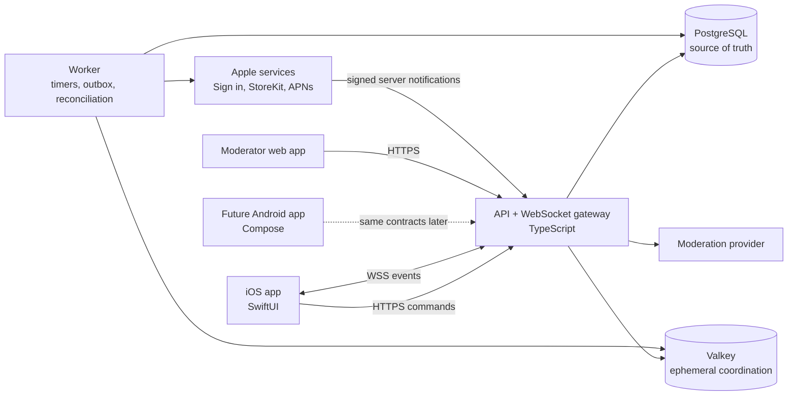
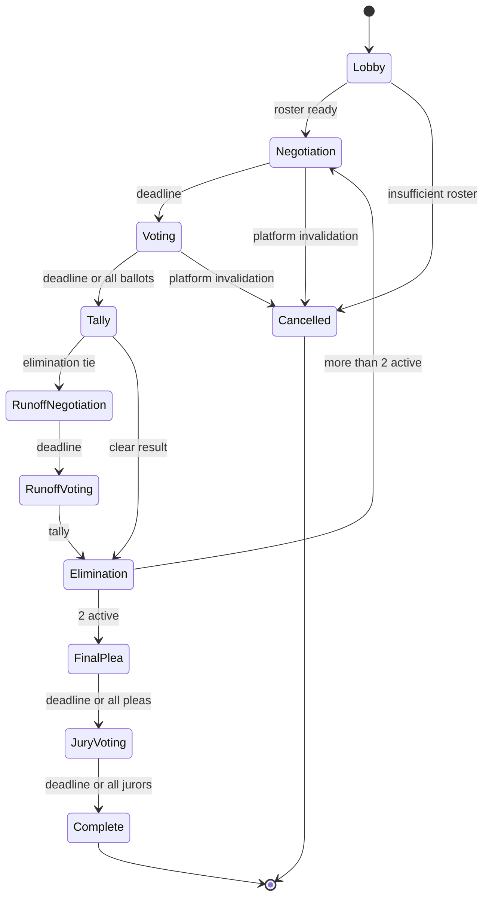

# Project Booth — Technical Architecture

**Status:** Proposed implementation baseline  
**Version:** 0.4<br>
**Depends on:** [MVP Product Specification](MVP_PRODUCT_SPEC.md)  
**Primary client:** Native iOS using Swift and SwiftUI  
**Future client:** Native Android using Kotlin and Compose

## 1. Architecture decision

Build Project Booth as a **modular monolith** with two runtime processes:

1. An API process serving versioned HTTPS endpoints and WebSocket events
2. A worker process executing timers, outbox delivery, notifications, purchase reconciliation, and scheduled moderation work

Both processes share one TypeScript codebase and one PostgreSQL database. Valkey is used only for disposable coordination such as presence, rate limits, matchmaking queues, and cross-instance real-time fan-out.

The recommended MVP stack is:

| Layer                  | Selection                                                                                  |
| ---------------------- | ------------------------------------------------------------------------------------------ |
| iOS client             | Swift, SwiftUI, Swift Concurrency, StoreKit 2                                              |
| HTTP contract          | OpenAPI 3.1                                                                                |
| Real-time contract     | Versioned JSON envelopes over secure WebSockets                                            |
| Backend                | TypeScript on current Node.js LTS with direct Fastify; locked for the MVP                  |
| Runtime packaging      | Provider-neutral OCI image shared by API and worker; native iOS builds stay outside Docker |
| Validation             | JSON Schema at every external boundary                                                     |
| Primary data           | PostgreSQL                                                                                 |
| Ephemeral coordination | Valkey                                                                                     |
| Production hosting     | To be selected later; portable containerized deployment                                    |
| Chat safety            | Deterministic filters plus a replaceable text-moderation provider and human review         |
| Admin interface        | Small authenticated React web application using the same HTTPS API                         |
| Observability          | Structured logs, OpenTelemetry, error tracking, and product analytics                      |

This avoids premature microservices while preserving clean module boundaries that can be extracted later if measured load or organizational needs justify it.

## 2. System context



## 3. Why this shape

### 3.1 Modular monolith, not microservices

Match state, votes, bribes, balances, moderation evidence, and phase transitions frequently participate in the same transaction. Keeping those operations in one deployable codebase makes correctness, local development, testing, and incident response much easier for an indie developer.

Modules communicate through explicit interfaces and domain events, not arbitrary cross-module table writes. A module can be extracted into a separate service later without making the MVP operate a distributed system from day one.

### 3.2 HTTPS commands and WebSocket events

All mutations use HTTPS commands with idempotency keys. WebSockets deliver server events and state-change notifications.

This split provides:

- Familiar authentication, validation, retry, and error behavior for commands
- Simple idempotency for purchases, offers, votes, reports, and account actions
- Real-time updates without trusting a persistent connection for correctness
- Straightforward reconnect: fetch a snapshot, then resume the event stream
- A future Android client that follows exactly the same protocol

The WebSocket is an optimization for immediacy. PostgreSQL remains authoritative if every socket disconnects.

### 3.3 PostgreSQL authority and Valkey coordination

PostgreSQL owns every durable fact:

- Accounts and identities
- Matches, rounds, deadlines, and memberships
- Messages and reports
- Offers and accepted bribes
- Votes and jury ballots
- Coin ledger entries and balances
- Purchases and refund status
- Blocks, sanctions, and moderation history
- Event outbox and audit records

Valkey owns only reproducible or disposable state:

- Online presence
- WebSocket connection routing
- Matchmaking queue membership
- Rate-limit counters
- Short-lived distributed locks or leases
- Cross-instance publish/subscribe

Loss of Valkey may interrupt matchmaking or live delivery, but it must never lose coins, votes, messages, reports, or match outcomes.

### 3.4 Fastify decision

The MVP backend framework is **direct Fastify**. NestJS will not be layered over it. This remains an application-framework choice rather than a protocol or data-architecture dependency: the match engine, ledger, PostgreSQL transactions, OpenAPI contracts, and WebSocket event envelopes stay framework-independent.

Direct Fastify fits the current indie scope because:

- The difficult code is explicit domain and transaction logic, not controller scaffolding.
- JSON Schema validation and serialization align directly with the contract-first OpenAPI approach.
- Plugins and encapsulation provide module boundaries without requiring a framework-wide dependency-injection container.
- The server-to-client WebSocket gateway is deliberately small; it does not need a large decorator-based gateway layer.
- Fewer framework abstractions make row locks, idempotency, outbox behavior, and failure paths easier to trace.
- It has a smaller conceptual and runtime footprint for one backend developer.

NestJS becomes attractive when:

- The developer is already substantially more productive with NestJS.
- Several backend developers need enforced conventions and consistent scaffolding.
- Built-in dependency injection, modules, guards, pipes, interceptors, and lifecycle hooks remove more work than they add.
- The project expects many adapters or transport styles and wants one uniform application framework.
- The moderator/admin backend grows into a broad enterprise-style application.

This is not simply “Fastify performance versus NestJS.” NestJS can use Fastify as its HTTP provider through `@nestjs/platform-fastify`, so the real choice is **direct Fastify** versus **NestJS's module, decorator, and dependency-injection layer running on Fastify**. Nest also provides structured WebSocket gateways and adapters. See the official [NestJS Fastify adapter](https://docs.nestjs.com/techniques/performance), [NestJS WebSocket gateways](https://docs.nestjs.com/websockets/gateways), and [Fastify reference](https://fastify.dev/docs/latest/Reference/).

The decision may be revisited only after the MVP if measured maintenance problems or team growth justify a migration. Ordinary implementation preference is not enough to mix both application frameworks in the MVP.

### 3.5 Runtime packaging

The backend ships as one provider-neutral OCI image with separate API and worker commands. A multi-stage build keeps compilers and development dependencies out of the runtime stage, and the runtime process uses a non-root user. The image must handle termination signals cleanly so API connections and claimed worker jobs can stop without avoidable corruption.

Docker Compose is the local orchestration layer for the API, worker, PostgreSQL, and Valkey. Each service remains a separate container, durable development data uses named volumes, and readiness-sensitive dependencies use health checks. Compose is a development and verification convenience, not the production hosting decision.

The native SwiftUI application is built and tested with Xcode and is never placed in the backend container. Production infrastructure must run the same backend image built in CI without requiring provider-specific application code.

## 4. Repository structure

The implementation should use one repository with platform boundaries visible in the directory layout:

```text
phone-booth/
├── apps/
│   ├── ios/                    # Xcode project and Swift packages
│   └── admin/                  # Moderator/support web app
├── services/
│   └── backend/
│       ├── src/
│       │   ├── modules/
│       │   ├── api/
│       │   ├── realtime/
│       │   ├── worker/
│       │   └── platform/
│       └── migrations/
├── packages/
│   ├── domain/                 # Shared IDs, timestamps, errors, results, and deterministic ports
│   ├── contracts/              # OpenAPI and real-time JSON Schemas
│   ├── game-engine/            # Pure deterministic domain logic
│   ├── config/                 # Typed configuration definitions
│   └── test-fixtures/
├── infra/
│   └── deployment/             # Provider-neutral container and environment docs
├── docs/
└── tests/
    ├── integration/
    ├── concurrency/
    └── load/
```

The Swift project consumes generated HTTP types from `packages/contracts/openapi.yaml`. The WebSocket payload schemas generate or validate Swift `Codable` models and TypeScript types during CI.

Apple's Swift OpenAPI Generator supports generating type-safe Swift client code from OpenAPI 3.x documents and works with a URLSession transport. It should generate transport ceremony, not product-domain state management. See the [official Swift OpenAPI Generator repository](https://github.com/apple/swift-openapi-generator).

### 4.1 Shared domain value conventions

Internal entity identifiers use RFC 9562 UUID text, normalized to lowercase
after validation. Domain timestamps use the canonical RFC 3339 subset
`YYYY-MM-DDTHH:mm:ss.sssZ`: UTC only, exactly three fractional digits, and a
valid calendar instant. Expected domain failures are serializable error values
returned through discriminated results rather than thrown exceptions.

Pure domain packages receive clocks and random sources through explicit ports.
They do not read the system clock or global random state directly.

## 5. Backend modules

### 5.1 Identity and sessions

Responsibilities:

- Exchange and verify Sign in with Apple credentials
- Create the platform-neutral Project Booth account
- Issue short-lived access tokens and rotating refresh tokens
- Register devices and push tokens
- Track App Attest keys and risk signals
- Revoke sessions and perform account deletion workflows
- Add Google identity linking later without changing the player identifier

Every player has one internal UUID. Provider identifiers live in a separate `user_identities` table.

### 5.2 Player and progression

Responsibilities:

- Pseudonymous profile and filtered display name
- Avatar, cosmetic inventory, level, and XP
- Daily reward eligibility
- Player restrictions and eligibility state
- Public profile projection containing only match-safe fields

### 5.3 Matchmaking

Responsibilities:

- Create and cancel queue tickets
- Group eligible players by ruleset, region, language, app compatibility, safety state, and block relationships
- Run ready confirmation
- Create a durable match and initial roster transactionally
- Avoid recently repeated pairings where practical
- Emit fill-time and cancellation analytics

Queue state may live in Valkey, but match creation is not complete until PostgreSQL commits the roster.

### 5.4 Match engine

The match engine is a pure deterministic package. It receives current state plus a command and returns either a validation error or a state transition with domain events.

It owns:

- Legal phase transitions
- Server deadlines
- Eligible senders, recipients, targets, voters, and jurors
- Normal ballots, automatic self-votes, runoff logic, and jury resolution
- Elimination and winner selection
- Disconnect and cancellation policy
- Remote-configured ruleset snapshots

It does not call databases, networks, clocks, StoreKit, push services, or moderation vendors directly. Time, IDs, and random tie-break values are explicit inputs so tests remain deterministic.



### 5.5 Chat and moderation

Responsibilities:

- Confirm sender and recipient are active in the same match
- Normalize Unicode and detect obfuscation
- Block contact details, links, spam, and deterministic prohibited terms
- Call the configured moderation provider for remaining free text
- Persist delivery outcome and policy reasons
- Deliver permitted messages through the outbox
- Create evidence-preserving reports
- Apply mute, block, chat restriction, suspension, and ban state

The provider interface returns categories and confidence values rather than deciding punishment. Product policy decides whether to allow, block, queue, or escalate. For an initial provider, OpenAI's moderation endpoint supports text classification across harmful-content categories; keep it behind an interface so it can be replaced or supplemented. See the [official moderation API reference](https://platform.openai.com/docs/api-reference/moderations).

If the moderation provider is unavailable:

- Deterministic filters continue operating.
- Structured quick phrases remain available.
- New free-text messages fail closed with a retryable explanation.
- Active matches continue; voting and formal offer cards do not depend on free text.

### 5.6 Economy and purchases

Responsibilities:

- Double-entry coin ledger
- Spendable, reserved, and pending balance buckets
- Match outflow counters and limits
- Bribe reservation, settlement, and reversal
- Cosmetic purchases and coin sinks
- Earned grants and fraud limits
- Store transaction verification, idempotency, refunds, and revocations
- Negative-balance restrictions and manual review

StoreKit 2 transactions are cryptographically signed and align with the App Store Server API. New server integrations should use App Store Server Notifications V2. See Apple's [StoreKit 2 overview](https://developer.apple.com/storekit/) and [Server Notifications setup](https://developer.apple.com/documentation/storekit/enabling-app-store-server-notifications).

### 5.7 Safety and administration

Responsibilities:

- Report queues and prioritization
- Message, match, device-risk, and transaction evidence views
- Enforcement actions and appeals
- Audit logging for every moderator action
- Remote kill switches
- Account support and deletion status
- Restricted access with mandatory multifactor authentication

### 5.8 Notifications

Responsibilities:

- APNs token lifecycle and environment separation
- Match-ready, reconnect, jury, moderation, and optional reward messages
- Deduplication and user preferences
- Provider-neutral notification jobs so FCM can be added for Android

### 5.9 Configuration and analytics

Responsibilities:

- Immutable ruleset version captured when a match is created
- Remote values for timers, roster size, grants, caps, rate limits, and moderation thresholds
- Analytics events that never include raw chat content
- Experiment assignments that cannot alter an in-progress match

Ruleset documents use an explicitly versioned JSON Schema and are validated
before activation. Version 1 defines roster bounds, phase durations,
communication limits, and fixed competitive-economy behavior. Each match stores
the ruleset identifier, version, and immutable validated snapshot so later
configuration changes cannot affect it.

Coin quantities are intentionally absent from the ruleset schema while economy
design is deferred. Rulesets contain only distinct namespaced references such
as `economy.match_outflow_cap.standard`; a separate, versioned economy
configuration will resolve those references after the values are approved.
Competitive invariants remain explicit in the ruleset, including cumulative
outgoing limits, no allowance restoration from incoming transfers, next-match
availability for in-match purchases, reversal restoration, and settlement on
any valid ballot so betrayal remains permitted.

## 6. Command transaction model

Every state-changing request follows one transaction pattern:

```mermaid
sequenceDiagram
    participant C as Client
    participant A as API
    participant P as PostgreSQL
    participant W as Outbox worker
    participant R as Realtime gateway

    C->>A: HTTPS command + idempotency key
    A->>P: BEGIN; lock relevant rows
    A->>P: validate actor, phase, version, limits
    A->>P: write domain data + audit + outbox event
    A->>P: COMMIT
    A-->>C: committed result + match version
    W->>P: claim outbox event
    W->>R: publish event through Valkey
    R-->>C: recipient-safe WebSocket event
```

Required guarantees:

- Idempotency keys are scoped to account and operation.
- Duplicate requests return the original result.
- Relevant match, offer, balance, or purchase rows are locked before validation.
- Domain changes and outbox records commit together.
- Events are published only after commit.
- Event delivery may repeat; clients deduplicate by event ID.
- A command may succeed even if the response is lost; clients reconcile instead of assuming failure.

## 7. Critical transaction algorithms

### 7.1 Accept bribe

Within one PostgreSQL transaction:

1. Lock the offer, sender coin account, recipient coin account, match player records, and idempotency record in a stable order.
2. Verify the offer is pending, unexpired, and belongs to the current negotiation round.
3. Verify both players remain active.
4. Verify sender spendable balance and remaining match outflow allowance.
5. Move the amount from sender `spendable` to recipient `pending` using balanced ledger entries.
6. Increment sender match outflow.
7. Mark the offer accepted.
8. Append private sender and recipient events plus the audit event to the outbox.

No code path inspects or modifies the recipient's ballot target.

### 7.2 Submit ballot

Within one transaction:

1. Lock the round and voter's match-player row.
2. Validate phase, deadline, voter eligibility, and target eligibility.
3. Upsert the final ballot for that voter and record the revision audit.
4. On the voter's first valid ballot, settle all of their current-round incoming `pending` bribes into `spendable` balance.
5. Append private ballot acknowledgement and balance events.
6. If every eligible ballot is present, enqueue an idempotent early-tally job.

Changing the ballot later never reverses settled bribes.

### 7.3 Missed ballot

When the server deadline closes:

1. Lock the round and all still-missing voter records.
2. Create the documented automatic self-votes.
3. Reverse each missing voter's current-round pending bribes to its original sender.
4. Restore each original sender's corresponding match outflow allowance.
5. Tally votes and advance through the match state machine.

### 7.4 Store purchase

Within one transaction:

1. Verify the signed transaction and expected app/environment/product.
2. Lock or create the purchase record by Apple's transaction identifier.
3. Return the original result if already processed.
4. Mint the configured amount through balanced system-issuance and player ledger entries.
5. If the player is in a match, mark the new value unavailable to that match.
6. Append purchase and balance events.

Refund and revocation notifications create compensating ledger entries; they never delete the original purchase.

## 8. Data model

Core tables and their ownership:

| Module      | Tables                                                                                      |
| ----------- | ------------------------------------------------------------------------------------------- |
| Identity    | `users`, `user_identities`, `sessions`, `devices`, `device_attestations`                    |
| Player      | `profiles`, `progression`, `inventory`, `daily_rewards`                                     |
| Matchmaking | `matchmaking_tickets`, `recent_pairings`                                                    |
| Match       | `matches`, `match_players`, `rounds`, `ballots`, `jury_ballots`, `match_events`             |
| Chat        | `chat_threads`, `messages`, `message_filter_results`, `mutes`                               |
| Economy     | `coin_accounts`, `ledger_transactions`, `ledger_entries`, `bribe_offers`, `store_purchases` |
| Safety      | `reports`, `blocks`, `enforcements`, `appeals`, `moderator_audit`                           |
| Platform    | `outbox_events`, `idempotency_keys`, `push_tokens`, `remote_configs`, `scheduled_jobs`      |

Important constraints:

- Ledger transactions contain at least two entries whose signed amount sums to zero.
- Balances cannot fall below permitted policy without creating a restriction state.
- One final normal ballot exists per voter per round, with revisions in audit history.
- One jury ballot exists per juror per match.
- Offer acceptance is unique and idempotent.
- Match versions increase monotonically.
- Every match references the immutable ruleset used at creation.
- Raw chat text is excluded from analytics exports.

## 9. Real-time protocol

### 9.1 Connection

- Connect over `wss://` using a short-lived authenticated access token.
- Send heartbeat frames and reconnect with bounded exponential backoff.
- On reconnect, fetch an HTTPS snapshot before resuming events.
- Never assume reconnection reaches the same server instance.
- Re-register foreground/background state for notification decisions.

The selected host must support long-lived secure WebSockets. Connections must still tolerate instance replacement, network changes, and mobile suspension through heartbeat, reconnect, snapshot, and event-resume behavior.

### 9.2 Event envelope

```json
{
  "schemaVersion": 1,
  "eventId": "01J...",
  "type": "bribe.offer.accepted",
  "occurredAt": "2026-07-20T12:34:56.789Z",
  "matchId": "01J...",
  "matchVersion": 42,
  "recipientCursor": 815,
  "payload": {}
}
```

Every event declares an audience:

- `player`: visible to one account
- `participants`: safe for active and eliminated match members
- `active`: safe only for active contestants
- `moderator`: internal evidence only

There is no generic broadcast of a domain record. A projection layer creates an audience-safe payload, and contract tests assert that ballot targets, private messages, offers, wallet details, device information, and moderation data never appear in broader events.

### 9.3 Snapshots

A match snapshot contains:

- Match and ruleset identifiers
- Current phase and authoritative deadline
- Client-safe roster and statuses
- Player-specific wallet, outflow allowance, pending funds, and submitted-ballot status
- Player-visible conversations and offer states
- Last recipient event cursor and match version

It never contains another contestant's ballot, private conversation, balance, report, or enforcement details.

## 10. iOS application architecture

### 10.1 Baseline

- Native Swift and SwiftUI
- iOS 17 or newer for the MVP
- Swift Concurrency for networking and state transitions
- StoreKit 2 for purchases
- URLSession for HTTPS and WebSocket transport
- Keychain for refresh-token storage
- APNs for push notifications
- App Attest and DeviceCheck signals for sensitive economy commands

The SwiftUI client is organized by feature rather than technical layer:

```text
BoothApp/
├── App/
├── Core/
│   ├── API/
│   ├── Realtime/
│   ├── Auth/
│   ├── Store/
│   ├── DesignSystem/
│   └── Telemetry/
├── Features/
│   ├── Onboarding/
│   ├── Home/
│   ├── Matchmaking/
│   ├── Booth/
│   ├── Chat/
│   ├── Bribes/
│   ├── Voting/
│   ├── Jury/
│   ├── Dossier/
│   ├── Shop/
│   └── Safety/
└── Resources/
```

Each feature owns its views, observable presentation state, and navigation. Domain state arrives from a single match store that applies snapshots and ordered server events. Views may optimistically display a sending state, but committed balances, ballots, offers, and phase changes appear only after server acknowledgement.

Use iOS semantic colors and Dynamic Type rather than fixed appearance values. Use SF Symbols by name. The red phone and booth atmosphere can be custom art, while navigation, sheets, text input, confirmations, accessibility, and purchase presentation should retain familiar system behavior.

### 10.2 Client responsibilities

The iOS app may:

- Render current server projections
- Validate obvious input constraints for responsiveness
- Queue one idempotent command retry
- Cache non-sensitive cosmetics and the latest safe snapshot
- Reconcile after foregrounding or reconnecting
- Display locally ticking countdowns anchored to a server deadline

The iOS app may not:

- Decide whether an offer, vote, or message is legal
- Mutate a committed coin balance locally
- Select a tie winner or advance a phase
- Trust device time for deadlines or rewards
- Infer hidden ballots from event gaps
- Grant purchases before backend verification

## 11. Authentication and abuse prevention

- Start with Sign in with Apple and a persistent Project Booth account.
- Use short access-token lifetimes and rotating, revocable refresh tokens.
- Store refresh tokens in Keychain and hashes server-side.
- Require recent App Attest assertions for purchase crediting, bribe acceptance, high-volume messaging, and suspicious-session recovery where supported.
- Treat attestation as a risk signal, not the sole authentication factor.
- Rate-limit by account, device risk, IP prefix, match, and action.
- Reject client-supplied price, reward, balance, clock, role, and eligibility values.
- Protect moderator access with separate roles, multifactor authentication, short sessions, and immutable audit logs.
- Rotate secrets and separate development, sandbox, staging, and production Apple credentials.

Apple recommends App Attest for checking that requests originate from a genuine, unmodified app instance; its current guidance also emphasizes server validation and fraud signals. See [Secure your apps with App Attest](https://developer.apple.com/videos/play/wwdc2026/201/).

## 12. Moderation policy pipeline

Message processing order:

1. Authenticate and authorize match/thread membership.
2. Normalize text and enforce length/rate limits.
3. Reject contact details, links, spam, and deterministic prohibited content.
4. Classify remaining text with the moderation provider.
5. Apply versioned product thresholds:
   - Allow
   - Allow and queue for sampling
   - Block and warn
   - Block and create urgent review
6. Persist the message, result, and policy version.
7. Write the delivery event to the transactional outbox.

Automated classification never permanently bans an account by itself. Severe classifications can block delivery and create an urgent review. Human actions and appeals remain auditable.

## 13. Deployment topology and indie cost

### 13.1 Provider decision gate

No production host is selected in this architecture version. Deployment remains portable and containerized until the framework spike, load profile, primary player geography, and launch budget are clearer.

The selected provider must support:

- A continuously running HTTPS and WebSocket service
- A continuously running or reliably scheduled worker
- Managed PostgreSQL with automated backups and point-in-time recovery
- Managed Valkey or a compatible low-latency service
- Private networking between application processes and datastores
- TLS termination, health checks, graceful shutdown, and rollback
- Metrics, structured logs, secrets, and separate staging/production environments
- A region acceptably close to the initial player population
- Vertical scaling followed by multi-instance horizontal scaling

Provider evaluation will compare:

- Monthly base cost and bandwidth pricing
- WebSocket behavior and connection limits
- Database reliability, backup, and recovery terms
- Available regions and measured mobile latency
- Deployment ergonomics for one developer
- Observability and incident-response tooling
- Vendor lock-in and migration effort

The operating-cost estimate is deferred until this provider comparison. It must include API compute, worker compute, PostgreSQL, Valkey, bandwidth, moderation, email, analytics, error tracking, domains, backups, taxes, and Apple program costs.

### 13.2 Scaling path

1. Vertically scale the API when connection or event-loop metrics justify it.
2. Add a second API instance; use Valkey publish/subscribe for recipient routing.
3. Enable managed PostgreSQL connection pooling and tune transaction indexes.
4. Separate the worker into timer, notification, and reconciliation processes only when queue delay shows contention.
5. Add regional deployments only after measuring player geography; keep each live match within one region.
6. Extract chat moderation or matchmaking only if their load or operational lifecycle materially differs from the core.

Do not shard the ledger or run multi-region writable PostgreSQL for the MVP.

## 14. Observability and operations

Every request, command, job, and event carries:

- Request ID
- Account ID where authorized
- Match ID and match version where applicable
- Idempotency key for mutations
- Trace ID
- Deployment version

Required dashboards and alerts:

- API error rate and latency
- Active WebSockets, reconnect rate, and dropped deliveries
- Match phase-transition delay and stuck matches
- Matchmaking queue age
- PostgreSQL saturation, lock waits, and transaction retries
- Outbox age and failed jobs
- Purchase verification and notification failures
- Ledger invariant violations
- Moderation-provider latency/failure and blocked-message rate
- APNs failure categories

Logs must not include raw access tokens, Apple signed transactions, full chat messages, personal contact data, or unrestricted moderator evidence.

Administrative controls must support disabling purchases, chat, new matchmaking, a ruleset, a client version, or an individual region without deploying code.

## 15. Testing strategy

### 15.1 Pure domain tests

- Every legal and illegal state transition
- Normal, runoff, all-player tie, jury tie, and no-juror outcomes
- Ballot changes and deadline behavior
- Accepted, betrayed, reversed, expired, and conflicting offers
- Deterministic clock, IDs, and tie-break inputs

### 15.2 Property and invariant tests

- Ledger entries always sum to zero
- No user exceeds configured match outflow
- Duplicate commands never duplicate value or ballots
- Hidden fields never enter unauthorized event projections
- A completed match has exactly one winner
- A cancelled match returns all reversible value

### 15.3 Integration and concurrency tests

- Two simultaneous accept attempts for the same offer
- Offer acceptance racing the negotiation deadline
- Ballot submission racing the voting deadline
- Refund racing a bribe acceptance
- Duplicate App Store notification delivery
- Worker crash after commit but before event publication
- Two workers claiming the same deadline
- Reconnect to a different API instance

### 15.4 Client and end-to-end tests

- Six simulated clients complete scripted matches
- iOS foreground/background and poor-network scenarios
- StoreKit local, sandbox, refund, and revoked-transaction flows
- Chat filter/report/block/moderator workflow
- Dynamic Type, VoiceOver, reduced motion, and color contrast
- App Review bot-demo flow

### 15.5 Load gates

Before TestFlight expansion:

- Sustain at least 1,000 WebSocket connections in a controlled test
- Run at least 100 simultaneous scripted matches
- Keep phase-transition delay under one second at the target load
- Demonstrate recovery from API restart without match corruption
- Demonstrate outbox replay without duplicate client-visible effects

These are initial engineering gates, not launch-capacity promises. Production instance sizes must follow measured results.

## 16. Delivery roadmap

This section summarizes architectural delivery gates. The authoritative one-chunk-at-a-time order, scope, and verification steps are maintained in the [Milestone Blueprint](PROJECT_BLUEPRINT.md).

### Phase 0 — Contracts and deterministic engine

- Establish repository/tooling
- Write OpenAPI and real-time envelope schemas
- Implement pure match state machine
- Implement ledger model and property tests
- Build scripted match simulator

**Exit:** A headless six-player match completes deterministically with bribes, betrayal, ties, jury, and dossier.

### Phase 1 — Vertical multiplayer slice

- Identity and profiles
- Matchmaking
- PostgreSQL command transactions and outbox
- API/WebSocket connectivity
- Minimal SwiftUI booth, chat, offer, vote, and result screens

**Exit:** Six devices/simulators complete a match with no purchases.

### Phase 2 — Economy and StoreKit

- Persistent wallet and double-entry ledger
- Earned grants, cosmetics, and outflow cap
- StoreKit 2 purchasing
- App Store Server Notifications V2
- Refund, revocation, negative-balance, and fraud paths

**Exit:** Purchase-to-bribe-to-refund tests preserve every ledger invariant.

### Phase 3 — Safety and operations

- Full filtering pipeline
- Mute, report, block, and enforcement
- Moderator interface and audit trail
- Account deletion, support, policies, and retention jobs
- Kill switches and operational dashboards

**Exit:** The complete Apple user-generated-content review path is testable.

### Phase 4 — Product completion

- Onboarding/tutorial and reviewer demo
- Jury retention and dossier polish
- Progression, shop, cosmetics, notifications, and analytics
- Accessibility, localization foundation, load tests, and TestFlight

**Exit:** Every acceptance criterion in the product specification passes in a production-like environment.

### Phase 5 — Android readiness audit

- Freeze stable v1 contracts
- Document identity, billing, push, and attestation adapters
- Verify no game rule exists only in Swift
- Create Android contract conformance tests

Android implementation begins only after iOS retention and core-loop data justify it.

## 17. Primary risks and mitigations

| Risk                          | Mitigation                                                                                                               |
| ----------------------------- | ------------------------------------------------------------------------------------------------------------------------ |
| Matchmaking liquidity         | Six-player default, region/language widening rules, wait-time telemetry, bot tutorial but no hidden bots in real matches |
| Payer advantage               | Fixed match outflow cap, earnable coins, purchaser/non-purchaser win monitoring, remote configuration                    |
| Refund laundering             | Backend verification, pending balances, transfer caps, compensating ledger entries, device/account risk signals          |
| Chat rejection or abuse       | Gameplay-only threads, no attachments/contact sharing, layered filtering, report/block, human moderation, reviewer demo  |
| Hidden vote leakage           | Recipient-specific projections, contract tests, no broad domain-event serialization                                      |
| Timer and disconnect disputes | Server deadlines, idempotent scheduler, snapshots, event cursors, documented missed-ballot policy                        |
| Jury abandonment              | Push notification, short final phase, participation reward/XP, deterministic fallback                                    |
| Platform lock-in              | Dockerized backend, PostgreSQL authority, standard Valkey protocol, provider adapters, OpenAPI contracts                 |
| Third-party IP confusion      | Original working brand, original assets/copy, no show or creator affiliation in metadata                                 |

## 18. Architecture completion criteria

The architecture is successfully implemented when:

1. The Swift client can be replaced by a contract test client without changing game behavior.
2. PostgreSQL can reconstruct balances, offers, votes, outcomes, and moderation actions after an API restart.
3. Valkey loss cannot corrupt durable game or economy state.
4. Every mutation is idempotent and emits events through the transactional outbox.
5. A second API instance can serve reconnecting players without sticky sessions.
6. Store purchase and refund flows preserve the double-entry ledger.
7. Free-text moderation failure does not stop voting or formal offer mechanics.
8. The same OpenAPI and event schemas are sufficient for a later Android client.
